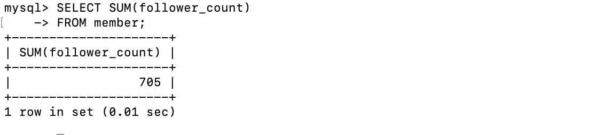
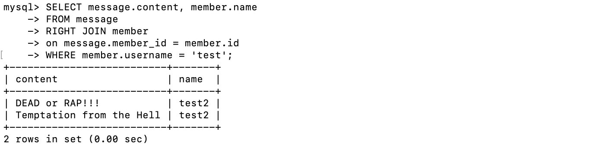

## 要求三
### 新增第一筆資料
```sql
INSERT INTO member(name, username, password)
VALUES ('Tae', 'test', 'test');
```

#### 新增其他資料-一次一筆
```sql
INSERT INTO member(name, username, password, follower_count)
VALUES ('Sakura', 'zombie1', '2008', 206);
	
INSERT INTO member(name, username, password, follower_count)
VALUES ('Saki', 'zombie2', '1997', 37);
	
INSERT INTO member(name, username, password, follower_count)
VALUES ('Ai', 'zombie3', '2008', 117);
	
INSERT INTO member(name, username, password, follower_count)
VALUES ('Junko', 'zombie4', '1983', 191);
	
INSERT INTO member(name, username, password, follower_count)
VALUES ('Yugiri', 'zombie5', '1882', 129);
	
INSERT INTO member(name, username, password, follower_count)
VALUES ('Lily', 'zombie6', '2011', 25);
```

#### 新增其他資料-一次多筆
```sql
INSERT INTO member(name, username, password, follower_count)
VALUES ('Sakura', 'zombie1', '2008', 206),
        ('Saki', 'zombie2', '1997', 37),
        ('Ai', 'zombie3', '2008', 117);
```
### 取得所有在member內的資料
```sql
SELECT * FROM member;
```

### 取得按照time欄排序後member內的所有資料
```sql
SELECT * FROM member
ORDER BY time DESC;
```

### 取得按照time欄排序後member內的第2~4筆資料
```sql
SELECT *
FROM member
ORDER BY time DESC
LIMIT 3
OFFSET 1;
```

### 取得username是test的會員資料
```sql
SELECT *
FROM member
WHERE username='test';
```

### 取得username是test且password是test的資料
```sql
SELECT *
FROM member
WHERE username='test' AND password='test';
```

### 將username是test的會員資料中的name欄修改為test2
```sql
UPDATE member
SET name = 'test2'
WHERE name = 'Tae';
```


## 要求四
### member資料表中，共有幾筆資料
```sql
SELECT COUNT(*) FROM member;
```

### member資料表中，所有會員ollower_count 欄位的總和
```sql
SELECT SUM(follower_count)
FROM member;
```

### member資料表中，所有會員ollower_count 欄位的平均數
```sql
SELECT AVG(follower_count)
FROM member;
```


## 要求五
### 建立messages資料表
```sql
CREATE TABLE message(
id BIGINT AUTO_INCREMENT,
member_id BIGINT NOT NULL,
content VARCHAR(255) NOT NULL,
like_count INT UNSIGNED NOT NULL DEFAULT 0,
time DATETIME NOT NULL DEFAULT CURRENT_TIMESTAMP,
PRIMARY KEY(id),
FOREIGN KEY(member_id) REFERENCES member(id)
);
```

### 使用 SELECT 搭配 JOIN 語法，取得所有留言，結果須包含留言者的姓名。
```sql
SELECT message.content, member.name
FROM message
RIGHT JOIN member
on message.member_id = member.id;
```


### 使用 SELECT 搭配 JOIN 語法，取得 member 資料表中欄位 username 是 test 的所有留言，資料中須包含留言者的姓名。
```sql
SELECT message.content, member.name
FROM message
RIGHT JOIN member
on message.member_id = member.id
WHERE member.username = 'test';
```

### 使用 SELECT、SQL Aggregate Functions 搭配 JOIN 語法，取得 member 資料表中欄位 username 是 test 的所有留言平均按讚數
```sql
SELECT AVG(like_count)
FROM message
RIGHT JOIN member
on message.member_id = member.id
WHERE member.username = 'test';
```
